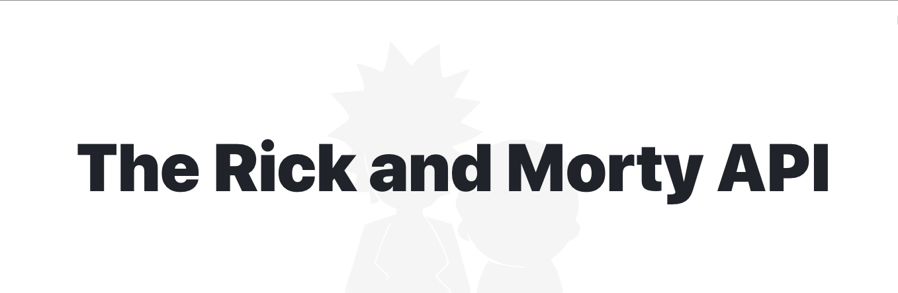

    

  
  
  
  

 

<h1></h1>

  <a href="#-tecnologias">Bibliotecas</a>&nbsp;&nbsp;&nbsp;|&nbsp;&nbsp;&nbsp;
  <a href="#-desenvolvimento">Desenvolvimento</a>&nbsp;&nbsp;&nbsp;|&nbsp;&nbsp;&nbsp;
  <a href="#-instalação">Instalação</a>

## 📚 Bibliotecas

- [Rick and Morty API](https://rickandmortyapi.com/)
- [Sweetalert2](https://sweetalert2.github.io/)
- [Lodash](https://lodash.com/)

## 🧑‍🔧 Desenvolvimento

- [TypeScript](https://www.typescriptlang.org/)
- [Eslint](https://www.npmjs.com/package/eslint)
- [Storybook](https://storybook.js.org/)

## 🧩 Instalação

### Baixe o projeto
    $ git clone git@github.com:rodrigobarbosa12/rick-and-morty.git

### Instale todas as dependências
    $ yarn

### Execute localmente
    $ yarn start

## Autor

<a href="https://www.linkedin.com/in/rodrigo-barbosa-7a1429157/">
 
    <b>Rodrigo Barbosa</b>
 
</a>
<a href="#" title="Rocket">🚀</a>

  
  

<Feito com 💙 />
